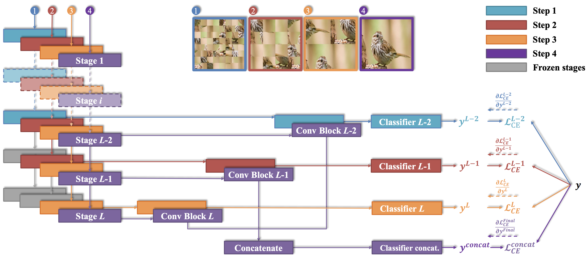

# Fine-Grained Visual Classification via Progressive Multi-Granularity Training of Jigsaw Patches

**This respository is implemnet for latest Version for ["Fine-Grained Visual Classification via Progressive Multi-Granularity Training of Jigsaw Patches"](#papers-and-projects). This respository don't cause an ERROR**

**This Project training 3 files at once as a Mixture of Granularity-Specific Experts Convolutional Neural Net and stores Experimental results. additionaly use wandb.**

**For paper implementations, see the section ["Papers and projects"](#papers-and-projects).**

## Framework


## Setup the enviroment for evaluation

```bash
$cd PMG
$sh test.sh 
```

## Default
Default inference. in `python main.py --seed 0 --dataset cub --imgsize 550 --crop 448 --model resnet50 --epochs 300 --batchsize 16 --gpu_ids 0,1`.


## Datasets
We implemented to load dataset, so It'll work if you just run it. but, CUB dataset needs to be download.
+ [CUB-200-2011](http://www.vision.caltech.edu/visipedia/CUB-200-2011.html)
+ [Stanford Cars](https://ai.stanford.edu/~jkrause/cars/car_dataset.html)
+ [FGVCaircraft](https://pytorch.org/vision/main/generated/torchvision.datasets.FGVCAircraft.html)


**File Structure**
```
├── dataset
│   ├── data
│   │     ├── aircraft
│   │     ├── stanfordcar
│   │     └── cubbird
│   ├── __init__.py
│   ├── augmentataion.py
│   └── etc..
│
├── models
│   ├── __init__.py
│   ├── base.py   
│   ├── grad_cam.py
│   └── local_cam.py
│
├── trainer
│   ├── __init__.py
│   ├── train.py   
│   └── infer.py
│   
├── main.py 
└── etc..
``` 

## Papers and projects

| Name                                                          | Location                                                        | Comment        |
| :------------------------------------------------------------ | :-------------------------------------------------------------- | :------------- |
| Fine-Grained Visual Classification via Progressive Multi-Granularity Training of Jigsaw Patches | [link](https://arxiv.org/pdf/2003.03836v3.pdf) | ECCV 2020     |
| Learning a Mixture of Granularity-Specific Experts for Fine-Grained Categorization | [link](https://github.com/kalelpark/Mixture-of-Granularity-Specific-Experts-for-Fine-Grained-Categorization) | ICCV 2019     | 

## How to cite
```
@article = {
    title = {Fine-Grained Visual Classification via Progressive Multi-Granularity Training of Jigsaw Patches},
    author = {Wongi Park},
    journal = {GitHub},
    url = {https://github.com/kalelpark/Latest_Progressive-Multi-Granularity-Training-of-Jigsaw-Patches},
    year = {2022},
}
```
